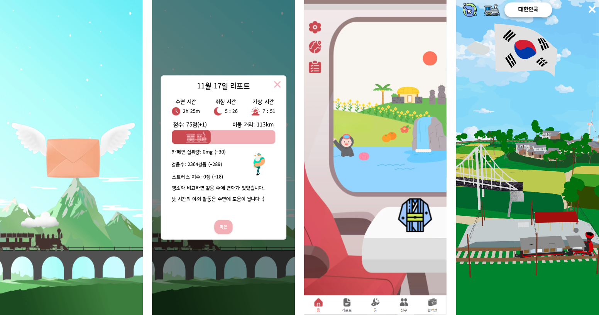

# 칙칙 포근포근
>  기차 여행 테마 건강한 수면 습관 개선 서비스  

워치 데이터를 통해 간편하게 수면 데이터를 연동, 수면 데이터를 통해 수면 점수를 분석해줍니다.  
분석 받은 수면 점수를 바탕으로 리포트를 받아보고 기차 여행을 떠나보아요:)

## 주요 기능
- 체크 리스트
    - 하루동안 섭취한 카페인을 검색을 통해 등록해 수면 분석에 사용 할 수 있다.
    - 엘라스틱 서치를 사용하여 역색인을 통한 빠른 검색, korean jaos로 한영오타 처리도 가능하다.
- 수면 리포트 
    - 카페인, 총 수면 시간, 수면 단계, 걸음 수, 스트레스에 따라 분석 후 수면 리포트를 제공한다.
    - 다중 회귀 분석을 통해 다른 데이터간의 관계를 분석하여 사용자에게 피드백을 제공한다.
- 기차 여행 테마
    - 수면 점수 기반으로 현재 위치에서 메인 화면으로 창밖 화면을 통해 도시의 랜드마크를 구경 할 수 있다.
    - 기차 밖의 모형을 3D로 구현하여 전체 지도와, 대륙 별 국가, 국가안 도시와 현재 기차 위치를 볼 수 있다.

## 세부 기능
- 꿈 기록 - 꿈 종류에 따른 꿈 일기 작성, 캘린더 작성
- 친구 - 친구와 함께 게임 가능, 친구와 나의 거리를 비교하여 경쟁, 음성 메시지를 통한 소통
- 컬렉션 - 해당 도시에 도착시 뽑기권 제공, 뽑기권을 통해 여행 시 소지 가능한 굿즈

## 아키텍쳐

## 개발 설정
[포팅 메뉴얼(메인 서버)](https://lab.ssafy.com/s09-final/S09P31E104/-/blob/develop/exec/1.%20%EB%B9%8C%EB%93%9C%20%EC%8B%9C%20%EC%82%AC%EC%9A%A9%EB%90%98%EB%8A%94%20%ED%99%98%EA%B2%BD%20%EB%B3%80%EC%88%98%20%EB%93%B1%EC%9D%98%20%EC%A3%BC%EC%9A%94%20%EB%82%B4%EC%9A%A9%20%EC%83%81%EC%84%B8%20%EA%B8%B0%EC%9E%AC/%ED%8F%AC%ED%8C%85%EB%A9%94%EB%89%B4%EC%96%BC(%EB%A9%94%EC%9D%B8%EC%84%9C%EB%B2%84).pdf?ref_type=heads)

[포팅 메뉴얼(ELK 서버)](https://lab.ssafy.com/s09-final/S09P31E104/-/blob/develop/exec/1.%20%EB%B9%8C%EB%93%9C%20%EC%8B%9C%20%EC%82%AC%EC%9A%A9%EB%90%98%EB%8A%94%20%ED%99%98%EA%B2%BD%20%EB%B3%80%EC%88%98%20%EB%93%B1%EC%9D%98%20%EC%A3%BC%EC%9A%94%20%EB%82%B4%EC%9A%A9%20%EC%83%81%EC%84%B8%20%EA%B8%B0%EC%9E%AC/%ED%8F%AC%ED%8C%85%EB%A9%94%EB%89%B4%EC%96%BC(ELK%20%EC%84%9C%EB%B2%84).pdf?ref_type=heads)

## 사용 예시
[사용 예시](https://lab.ssafy.com/s09-final/S09P31E104/-/blob/develop/exec/3.%20%EC%8B%9C%EC%97%B0%20%EC%8B%9C%EB%82%98%EB%A6%AC%EC%98%A4/%EC%8B%9C%EC%97%B0%20%EC%8B%9C%EB%82%98%EB%A6%AC%EC%98%A4.pdf?ref_type=heads)

[UCC](https://www.youtube.com/watch?v=dGGt7w4j8eI&ab_channel=HyoinJeong)
